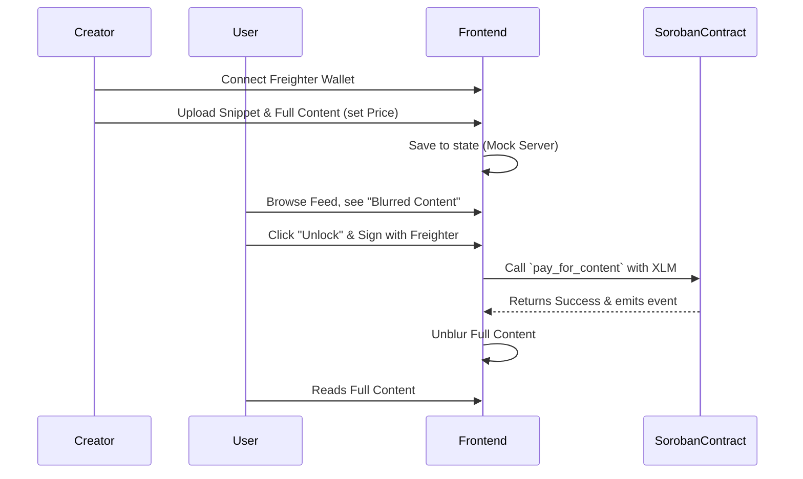

# StellarStream MVP Architecture

StellarStream is a "Pay-per-View" content platform leveraging Soroban Smart Contracts.

## Tech Stack
- Frontend: Next.js + Tailwind CSS
- Wallet: Freighter Wallet Plugin
- Backend Storage: Mocked in MVP (Supabase intended)
- Smart Contract: Soroban (Rust)
- Network: Stellar Testnet

## Flow Diagram

