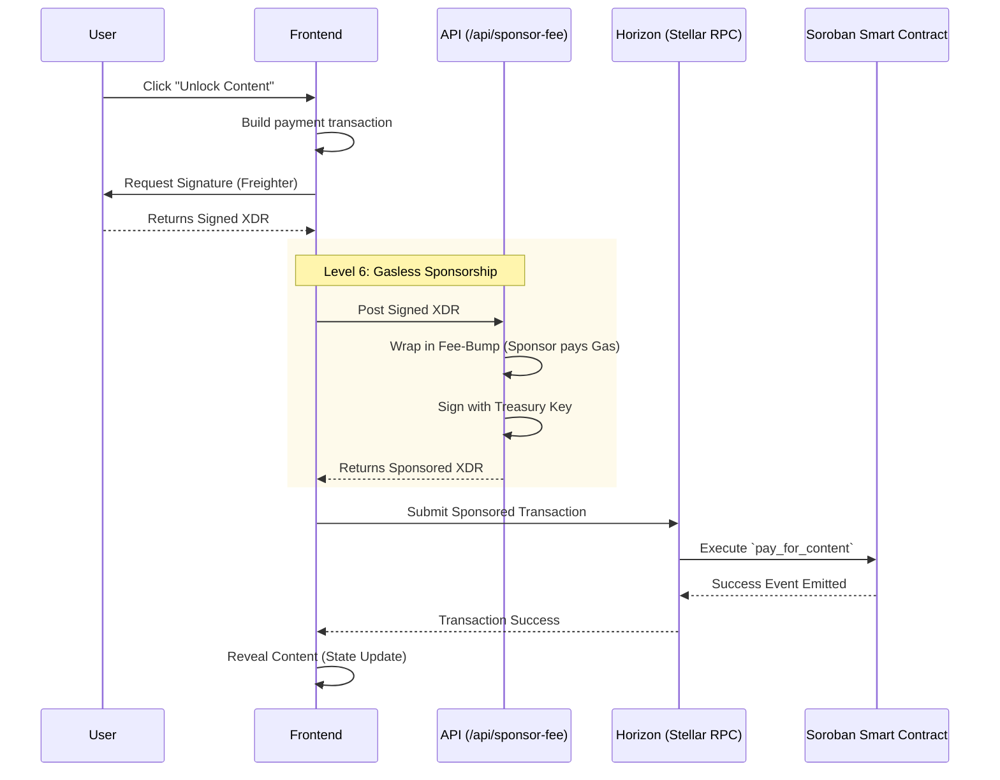
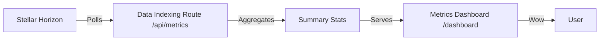

# StellarStream 'Black Belt' Architecture

StellarStream is a decentralized "Pay-per-View" content platform leveraging Soroban Smart Contracts. This document details the Level 6 architectural components, including gasless fee sponsorship and real-time data indexing.

## Tech Stack
- **Frontend**: Next.js 15 + Tailwind CSS v4 + Framer Motion
- **Wallet**: Freighter Wallet Plugin (Stellar Wallets Kit ready)
- **Fee Sponsorship**: Next.js API + Stellar SDK Fee-Bump transactions
- **Data Indexing**: Horizon API + Custom Indexing Middleware
- **Smart Contract**: Soroban (Rust)
- **Network**: Stellar Testnet

## 🏗 System Flow (Level 6)

### 1. Unified Transaction Flow (with Fee Sponsorship)
This diagram illustrates the lifecycle of a content unlock, including the automated Fee-Bump sponsorship.

### 2. Metrics Indexing Flow
How data is surfaced in the Analytics Dashboard.

## System Components

### 1. Gasless Fee Sponsorship API
Located at `src/app/api/sponsor-fee/route.ts`. It eliminates the need for users to hold XLM for fees by wrapping user transactions in a **Fee-Bump** signed by the project treasury.

### 2. Data Indexing Middleware
Located at `src/app/api/metrics/route.ts`. It provides an abstraction layer over the raw Horizon API, serving curated statistics like TVL (Total Value Locked) and DAU (Daily Active Users) to the dashboard.

### 3. Analytics Dashboard
Located at `/dashboard`. A real-time monitoring interface for protocol health, using **Lucide React** for iconography and **Framer Motion** for smooth, premium transitions.

## 🛡️ Security Model
- **Non-Custodial**: Neither the platform nor the sponsor ever holds the creator's funds. All XLM transfers are direct-to-creator via the contract logic.
- **Checked Arithmetic**: All smart contract calculations used in Phase 2/3 implement overflow protection.
- **CEI Pattern**: All state mutations follow the **Checks-Effects-Interactions** model to prevent reentrancy and state corruption.

## Future Roadmap: Scaling Beyond Level 6
- **Persistent Indexing**: Migrate from live-polling to a persistent Postgres/Supabase store for historical trend analysis.
- **Content Integrity**: Move content blobs to IPFS/Pinata with CID-on-ledger verification.
- **Subscription Cycles**: Implement Soroban contracts that support recurring access TTL (Time-To-Live).
