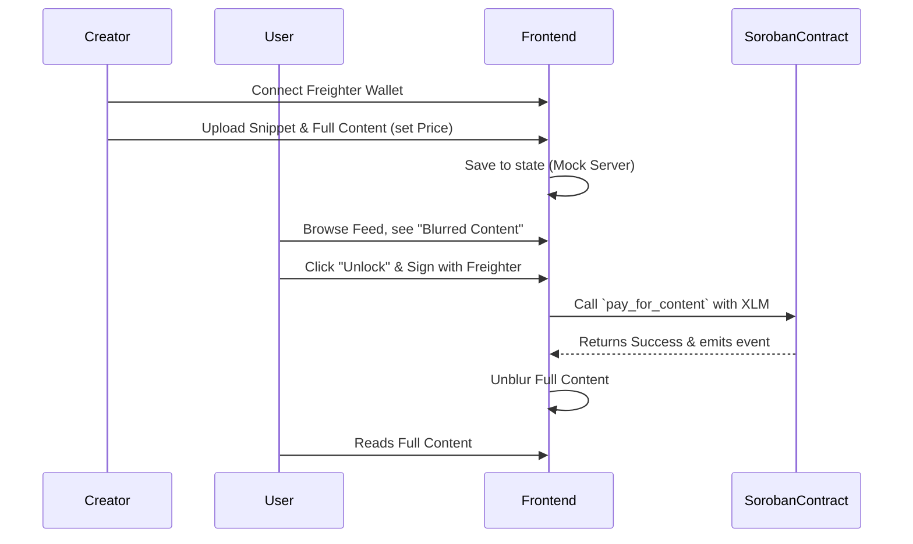

# StellarStream MVP Architecture

StellarStream is a "Pay-per-View" content platform leveraging Soroban Smart Contracts.

## Tech Stack
- Frontend: Next.js + Tailwind CSS
- Wallet: Freighter Wallet Plugin
- Backend Storage: Mocked in MVP (Supabase intended)
- Smart Contract: Soroban (Rust)
- Network: Stellar Testnet

## System Flow

## System Components

### 1. Frontend (Next.js)
- **State Management**: Uses an in-memory mock store (`src/lib/store.ts`) for MVP performance.
- **Wallet Integration**: Interfaces with Freighter via `@stellar/freighter-api` to sign transactions securely on the client side.
- **Horizon Client**: Communicates directly with `https://horizon-testnet.stellar.org` to submit transactions and fetch account history.

### 2. Soroban Smart Contract (Rust)
Located in `contracts/paywall`, the contract provides a verifiable on-chain record of payments.
- **Function**: `pay_for_content`
- **Logic**: Executes a `token::Client` transfer from the buyer to the creator.
- **Events**: Emits a `(buyer, creator)` event with the `amount` for frontend indexing.

### 3. Data Flow (Unlock Process)
1.  **Request**: User clicks "Unlock" on a content item.
2.  **Signing**: Frontend builds an `Operation.payment` (or `InvokeHostFunction` for Soroban) and requests a signature from Freighter.
3.  **Submission**: The signed XDR is submitted to the Stellar Testnet via Horizon.
4.  **Verification**: Frontend waits for a successful ledger inclusion and then updates the local React state to reveal the `fullContent`.

## Future Roadmap: Scaling Beyond MVP
- **Persistent Storage**: Move from in-memory store to Supabase or MongoDB.
- **Content Integrity**: Store large content blobs on IPFS and save only the CID on the Stellar ledger.
- **Subscription Model**: Implement a "Time-To-Live" (TTL) on content access using Soroban's state expiration features.
