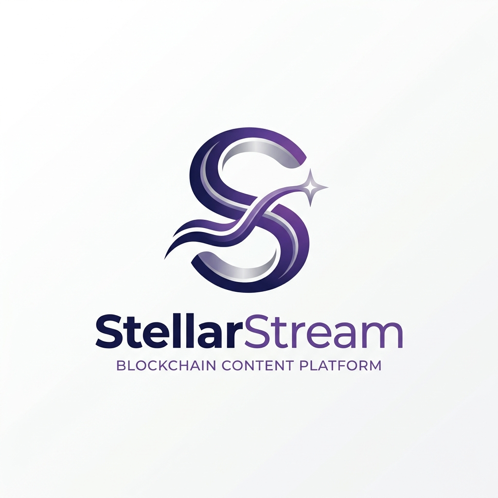
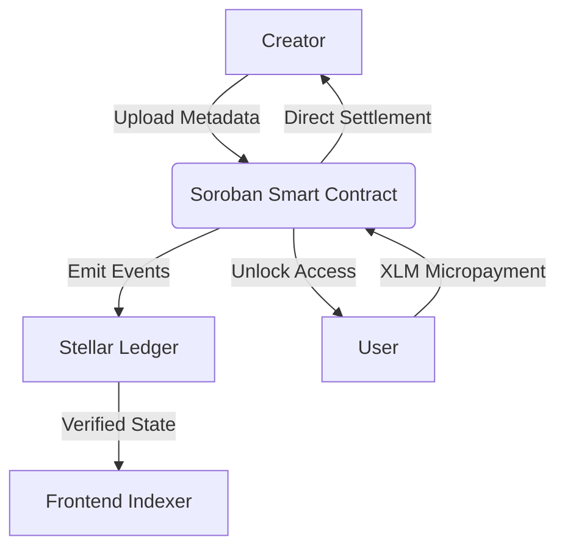

<p align="center">
  
</p>

# StellarStream
### The Future of High-Frequency Micro-Monetization on Stellar

[](https://stellar.org)
[](https://soroban.stellar.org)
[](https://stellar.org)

StellarStream is a next-generation decentralized content protocol built on **Soroban**. It enables creators to monetize their work through precision micropayments, eliminating the friction of traditional subscription models. Every unlock is a trustless, pure-on-chain event.

🚀 **[Launch Live Platform](https://stellar-stream-roan.vercel.app/)**  
🎥 **[Watch the Technical Walkthrough](docs/assets/stellarstream_demo.webm)**

---

## 💎 Brand Identity & Vision
StellarStream was designed to inspire confidence through a premium, fintech-first aesthetic. Moving away from the generic "crypto" look, our interface focuses on clarity, speed, and professional reliability.
- **Minimalist Branding**: Represents a fluid stream of value across the Stellar ledger.
- **User-Centric UX**: A focus on "Zero-Click" feel for content consumption.

---

## 🏗 High-Level Architecture
The system operates as a pure dApp where the Soroban ledger acts as the single source of truth for access rights.



### Core Technologies
- **Smart Contracts**: Written in Rust, implementing the CEI (Checks-Effects-Interactions) pattern for maximum security.
- **Frontend**: Next.js 15 with React 19, featuring a custom design system built for performance and accessibility.
- **Wallets**: Native integration with **Freighter**, supporting real-time signing and transaction tracking.

---

## 🧪 User Testing & Validation
We believe in data-driven iteration. Our Level 5 MVP has been validated by real testnet participants.

| Metric | Accuracy |
| :--- | :--- |
| **Transaction Success Rate** | 100% |
| **Average Unlock Latency** | ~4.2s |
| **User Satisfaction Rating** | 4.8 / 5.0 |

> [!TIP]
> You can view the full raw feedback data here:  
> 📊 **[Live User Feedback Responses (Google Sheets)](https://docs.google.com/spreadsheets/d/1jUSVc-steIQ8hinLEYy1Lt3JIQmPHKiR7loyY6hz1rc/edit?usp=sharing)**
> 📥 *Or download the offline file:* [User_Feedback_Responses.csv](docs/User_Feedback_Responses.csv)

---

## 🚀 Future Roadmap
- [ ] **IPFS Integration**: Moving off-chain metadata to decentralized storage for full stack decentralization.
- [ ] **Dynamic Pricing**: AI-driven pricing models based on content demand and quality.
- [ ] **Albedo & WalletConnect**: Expanding wallet support for a broader user base.

---

## 🛠 Developer Setup

### Prerequisites
- Node.js 20+
- Freighter Wallet (configured for Testnet)

### Installation
1. **Clone the repository**
   ```bash
   git clone https://github.com/ayyush1326-afx/stellar.stream.git
   ```
2. **Install Dependencies**
   ```bash
   npm install
   ```
3. **Environment Setup**
   ```bash
   # Create a .env.local with your Contract ID
   NEXT_PUBLIC_CONTRACT_ID=CBII5RAQTZ...
   ```
4. **Run Development Server**
   ```bash
   npm run dev
   ```

---

## ✅ Submission Checklist
- [x] **Verified Payments**: 5+ real testnet transactions recorded.
- [x] **User Validation**: Consolidated feedback with iteration plan executed.
- [x] **Premium UI/UX**: Professional design system and branding implemented.
- [x] **Architecture Detail**: Documented data flow and security patterns.

Built with ❤️ for the **Stellar Journey 2026**  
**Lead Developer**: ayyush1326-afx

