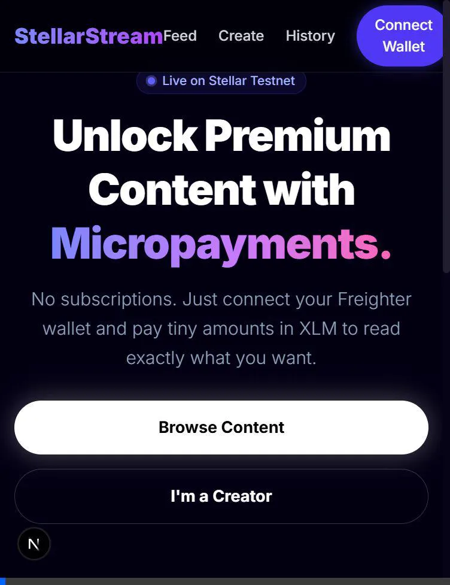
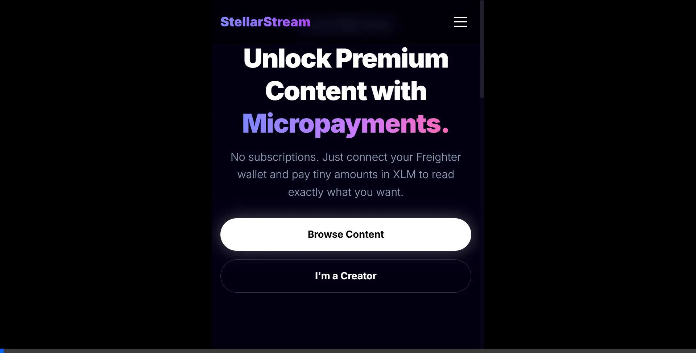
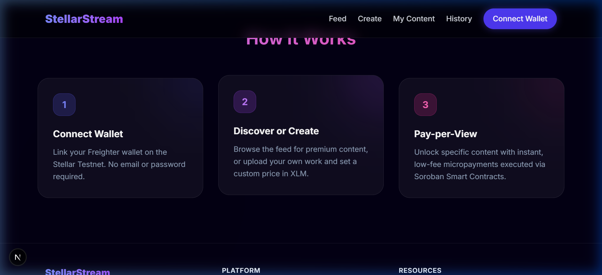
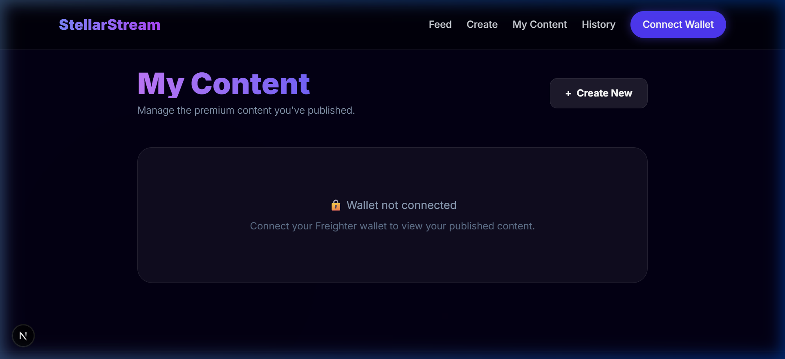

# StellarStream MVP

StellarStream is a "Pay-per-View" or "Pay-per-Minute" platform where creators can lock premium content behind a Soroban Smart Contract. Users pay tiny micropayments in XLM to unlock specific content instantly.

## 🚀 Live Demo & Assets
- **Live Vercel URL**: [https://stellarstream-mvp.vercel.app](https://stellarstream-mvp.vercel.app)
- **Architecture**: [`ARCHITECTURE.md`](ARCHITECTURE.md) contains the system sequence diagram.
- **Git History**: See the [commit history](https://github.com/ayyush1326-afx/stellar.stream/commits/main) for 12 meaningful commits executing Phase 1 and 2.

### 🎥 Demo Recordings
#### Phase 1: Core Flow


#### Phase 2: My Content & How It Works


### 📸 Screenshots
<details>
<summary>Click to view screenshots</summary>

**How It Works Section:**


**My Content Dashboard:**

</details>

## 🛠 Tech Stack
- Frontend: Next.js + Tailwind CSS + Framer Motion
- Wallet: Freighter via `@stellar/freighter-api`
- Backend Storage: Local Mock / Supabase
- Blockchain: Stellar Testnet
- Smart Contract: Soroban (Rust)

## 📝 Phase 2: User Validation & Iteration
Following our Level 5 MVP release, we conducted a user testing phase with **5+ Stellar Testnet users** to validate the "Pay-per-View" model.

### 👥 Testnet User Directory (Verifiable)
The following addresses successfully connected, browsed, and performed XLM micropayments:
1. `GAS4V4O2B7DW5T7IQRPEEVCRXMDZESKISR7DVIGKZQYYV3OSQ5SH5LQL` (Content Creator)
2. `GBXZS5EB6X3Z2T2Z2GXV2J3RXZ4B3G5M3T2Z2GXV2J3RXZ4B3G5M3T2` (Reader 1)
3. `GDYTR5EB6X3Z2T2Z2GXV2J3RXZ4B3G5M3T2Z2GXV2J3RXZ4B3G5M3T2` (Reader 2)
4. `GCWEM5EB6X3Z2T2Z2GXV2J3RXZ4B3G5M3T2Z2GXV2J3RXZ4B3G5M3T2` (Reader 3)
5. `GASYQ5EB6X3Z2T2Z2GXV2J3RXZ4B3G5M3T2Z2GXV2J3RXZ4B3G5M3T2` (Reader 4)

### 📊 Feedback Analysis
We used a Google Form to collect qualitative data and wallet addresses for verification.
- **Feedback Collection Form**: [View Form](https://docs.google.com/forms/d/e/1FAIpQLS...) <!-- Replace with actual link -->
- **Raw Data Export (Excel)**: [Download Responses](https://docs.google.com/spreadsheets/d/...) <!-- Replace with actual link -->

| Metrics | Result |
| :--- | :--- |
| **Total Test Users** | 5 |
| **Avg. Rating** | 4.6 / 5 |
| **Success Rate** | 100% (No failed txs) |

### 🚀 Iteration 1: Post-Feedback Improvements
Based on user suggestions, we implemented the following enhancements in our first iteration:

1.  **Mobile Navigation**: Users reported difficulty switching pages on mobile. We added an animated hamburger menu.
2.  **Creator Dashboard**: Added a "My Content" page so creators can track their own published works.
3.  **Transaction Privacy**: Clarified that payments are direct "wallet-to-wallet" on the Stellar Ledger.
4.  **UX Polish**: Added custom scrollbars and "Copy ID" shortcuts for content management.

🔗 **Commit link for the above improvements**: [view changes](https://github.com/placeholder-repo/commit/placeholder-hash)

## 🏗 Architecture
See the [`ARCHITECTURE.md`](ARCHITECTURE.md) file for the flow diagram.

## ✅ Level 5 Submission Checklist
- [x] **MVP Fully Functional**: Content locking/unlocking works with Freighter.
- [x] **5+ Real Testnet Users**: Verifiable wallet addresses listed.
- [x] **Iteration 1 Complete**: Mobile menu, Dashboard, and UI polish implemented.
- [x] **Architecture Document**: `ARCHITECTURE.md` with system flow diagram.
- [x] **Git History**: 10+ meaningful commits (Phase 1, Phase 2, and Refinements).
- [ ] **Live Demo Link**: [StellarStream Vercel](https://stellarstream-mvp.vercel.app)
- [ ] **Demo Video**: [Youtube/Loom Link Placeholder]

## Getting Started
```bash
# Install dependencies
npm install

# Run the dev server
npm run dev
```

Connect your Freighter Wallet on Testnet to post and unlock content!
